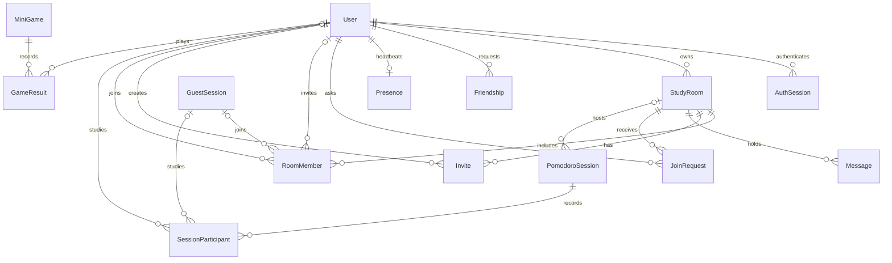

# WePomodoro backend

Express 5 + Prisma 7 + PostgreSQL. This single document covers setup, the HTTP
API, the data model, timer accounting, and testing. A product “server” is a
`StudyRoom` in the database.

Contents:

1. [Setup and running](#1-setup-and-running)
2. [Authentication](#2-authentication)
3. [API reference](#3-api-reference)
4. [Data model](#4-data-model)
5. [How timers and statistics work](#5-how-timers-and-statistics-work)
6. [Minigames](#6-minigames)
7. [Deletion and lifecycle](#7-deletion-and-lifecycle)
8. [Migrations](#8-migrations)
9. [Testing](#9-testing)
10. [Source map and frontend integration](#10-source-map-and-frontend-integration)

---

## 1. Setup and running

The API uses `backend/.env` (`DATABASE_URL`). Copy `.env.example` and fill it in.

```bash
cd backend
npm ci
npm run db:deploy   # applies committed migrations to DATABASE_URL
npm run dev         # generates the Prisma client, then starts tsx watch
```

`db:deploy` changes tables in the configured database; starting the API never
applies migrations. For a compiled run use `npm run build` then `npm start`.
Production transport should provide HTTPS so bearer tokens aren't sent in clear.

Environment variables:

| Variable       | Default                 | Meaning                                               |
| -------------- | ----------------------- | ----------------------------------------------------- |
| `DATABASE_URL` | none (required)         | PostgreSQL connection string                          |
| `PORT`         | `3000`                  | Listening port (1–65535)                              |
| `CORS_ORIGIN`  | `http://localhost:5173` | Comma-separated exact origins allowed to call the API |

In development (`NODE_ENV` not `production`) the API also serves a test console at
`http://localhost:3000/dev`: presets for the main endpoints, with the token, room,
timer, invite and request IDs filled in from earlier responses. It is not mounted
in production.

To skip tokens in the console, set `DEV_AUTH=true` in `backend/.env` and restart. A
"no token, act as" checkbox then appears in the console header with a list of
users and guests; requests carry `X-Dev-User: <username>` (or `guest:<id>`) instead
of a Bearer token, and untick it to use a real token again. The header is ignored
unless `DEV_AUTH=true` and `NODE_ENV` is not `production`; never enable it on a
shared server, since it lets any caller act as anyone.

Requests with no `Origin` header (curl, native clients) are accepted. A browser
`Origin` that isn't listed gets 403. CORS is not authentication.

With Docker Compose the backend runs as the unprivileged `node` user (uid 1000),
so files generated into the bind-mounted source tree (such as
`src/generated/prisma`) belong to your user, not root.

Shutdown (`SIGINT`/`SIGTERM`) stops the timer worker, closes idle keep-alive
connections, waits for an in-flight sweep, disconnects Prisma, and exits. If that
takes longer than 10 seconds the process exits with code 1.

---

## 2. Authentication

All endpoints live under `/api`; there are no root-path aliases. The only
non-`/api` route is `GET /`, which returns `{ service, health }`.

Signup/login return a random `token`, its expiry, and a safe user profile. Guests
receive a token and a temporary guest profile. Send the token on later requests:

```http
Authorization: Bearer <token>
```

- Registered sessions last **7 days**, guest sessions **24 hours**.
- Only SHA-256 hashes of tokens are stored. Passwords use salted scrypt with
  constant-time comparison.
- Rate limits (per process, in memory): signup, login, guest creation and
  `POST /api/users` allow 20 requests per IP per minute, and login additionally
  allows 8 **failed** attempts per username per 15 minutes (successful logins
  don't count, and `Alice`/`alice` share one counter). Exceeding either returns
  429 with `Retry-After`. A multi-instance deployment should also enforce a
  shared limit at its gateway.
- Behind a reverse proxy set `TRUST_PROXY` to the number of proxies (0 when
  exposed directly). Too low makes all clients share the proxy's IP; too high
  lets clients spoof their IP with `X-Forwarded-For`.
- Existing profiles with a null `passwordHash` cannot password-login. Don't
  recreate accounts or let someone claim a passwordless profile by supplying its
  email; they need an explicit provisioning/recovery flow (email delivery and
  verification are not implemented). New signups require a password.
- Registered logout revokes the current token and leaves timers running. Guest
  logout cancels solo timers and removes the temporary identity and its
  participation; registered users' shared history is preserved.
- A worker finalizes elapsed timers about once per second and removes expired
  auth/guest identities every minute.

Input rules:

- Usernames: 3–32 letters, numbers, underscores or hyphens; lowercased.
- Emails: valid format, at most 254 characters; trimmed and lowercased.
- Passwords: 8–128 characters; never trimmed. `currentPassword` and the password
  sent to `DELETE /api/users/me` are only checked for being a string of at most
  128 characters, so accounts with older, shorter passwords can still verify.
- Guest names: 1–32 characters after trimming.

---

## 3. API reference

**Base URL:** `http://localhost:3000/api`. Send JSON with
`Content-Type: application/json` (bodies are limited to 16 KB). Success responses
are JSON, except 204 which has no body. UUID placeholders need real IDs; user IDs
are integers.

Access labels: **Public** = no token; **Authenticated** = registered user or
guest; **Registered** = registered user; **Member** = room member;
**Owner** = room owner; **Timer owner** = solo participant or shared room owner.

### 3.1 Service and authentication

| Method | Endpoint                           | Access        | JSON body                                                                | Response                                                                                                                |
| ------ | ---------------------------------- | ------------- | ------------------------------------------------------------------------ | ----------------------------------------------------------------------------------------------------------------------- |
| GET    | `/api/health`                      | Public        | None                                                                     | 200 `{ status: "ok" }`; database connectivity only                                                                      |
| POST   | `/api/auth/signup`                 | Public        | `{ "email", "username", "password" }`                                    | 201 `{ token, expiresAt, user }`                                                                                        |
| POST   | `/api/users`                       | Public        | Same signup body                                                         | 201: alias of signup with the same response                                                                             |
| POST   | `/api/auth/login`                  | Public        | `{ "username", "password" }`                                             | 200 `{ token, expiresAt, user }`; with two-factor on: `{ twoFactorRequired, challengeToken, expiresAt }` and no session |
| POST   | `/api/auth/login/2fa`              | Public        | `{ "challengeToken", "code" }` or `{ "challengeToken", "recoveryCode" }` | 200 `{ token, expiresAt, user }`; 401 on a wrong code                                                                   |
| POST   | `/api/auth/guest`                  | Public        | `{ "displayName" }`                                                      | 201 `{ token, guest: { id, displayName, expiresAt } }`                                                                  |
| POST   | `/api/auth/password-reset/request` | Public        | `{ "email" }`                                                            | 202 same message whether or not the account exists; emails a 6-digit code                                               |
| POST   | `/api/auth/password-reset/verify`  | Public        | `{ "email", "code" }`                                                    | 200 `{ resetToken, expiresAt }`; the code is spent                                                                      |
| POST   | `/api/auth/password-reset/confirm` | Public        | `{ "resetToken", "password" }`                                           | 204; sets the password and signs out every session                                                                      |
| POST   | `/api/auth/verify-email`           | Registered    | `{ "code" }`                                                             | 204: confirms the address; sets `emailVerifiedAt`                                                                       |
| POST   | `/api/auth/verify-email/resend`    | Registered    | None                                                                     | 202: emails a new code (3 per 15 minutes); 409 if already verified                                                      |
| GET    | `/api/auth/me`                     | Authenticated | None                                                                     | 200 `{ type: "user" or "guest", profile }`                                                                              |
| POST   | `/api/auth/logout`                 | Authenticated | None                                                                     | 204: revoke login or delete temporary guest identity                                                                    |

### Two-factor authentication (TOTP)

Optional per account: an authenticator app (any RFC 6238 app) gives a 6-digit code
every 30 s. Intended UX: after signup the client offers to turn it on (the user
can skip), and a registered user can turn it on or off later from their profile
page. Backend flow:

| Method | Endpoint                       | Body                                       | Result                                                     |
| ------ | ------------------------------ | ------------------------------------------ | ---------------------------------------------------------- |
| GET    | `/api/auth/2fa`                | None                                       | `{ enabled, recoveryCodesLeft }`                           |
| POST   | `/api/auth/2fa/setup`          | `{ "password" }`                           | `{ secret, otpauthUri }`; show as QR/text. Not active yet. |
| POST   | `/api/auth/2fa/enable`         | `{ "code" }`                               | `{ recoveryCodes }`: 10 codes, shown **once**; now active  |
| POST   | `/api/auth/2fa/recovery-codes` | `{ "password" }`                           | New `{ recoveryCodes }`; the old ones stop working         |
| POST   | `/api/auth/2fa/disable`        | `{ "password", "code" or "recoveryCode" }` | 204                                                        |

Once on, `POST /api/auth/login` answers a correct password with
`{ twoFactorRequired: true, challengeToken, expiresAt }` instead of a session. The
client then calls `POST /api/auth/login/2fa` with that token and a current `code`
(or a `recoveryCode`) within 5 minutes. Five wrong codes cancel the challenge
(sign in again). A code can be used once: a step no later than the last accepted
one is rejected, and each recovery code works once. Setup, disable and recovery
codes require the account password; failed attempts on them are limited to 8 per
15 minutes. The secret is stored AES-256-GCM encrypted with `TWO_FACTOR_KEY`
(32 random bytes, base64; without it these endpoints return 503). Losing or
changing the key makes every stored secret unreadable. Password reset ends all
sessions but leaves two-factor on.

The health check verifies connectivity, not whether all migrations are applied.
Authentication runs before protected routing, so unknown paths without a valid
token may return 401 before 404.

### Email verification

Signup creates the account, returns the session token as before, and emails a
six-digit code (valid 30 minutes, newest only, 5 wrong guesses kill it). The
frontend then asks for it and calls `POST /api/auth/verify-email`. Verification
is **not enforced anywhere yet**: unverified accounts can still use the API.
Changing the email through `PATCH /api/users/me` clears `emailVerifiedAt`, and
`/auth/me` and the profile endpoints now include `emailVerifiedAt`.

### Password recovery flow

1. The user enters their email. `request` always answers 202 with the same
   message, so addresses can't be discovered. If an account has that email, a
   six-digit code is emailed. It expires in 10 minutes, only the newest request
   is valid, and only its hash is stored. Requests are limited to 3 per address
   per 15 minutes.
2. The user enters the code. `verify` returns 400 for a wrong, expired or
   reused code (same message in every case). After 5 wrong guesses that code is
   dead and a new one must be requested. A correct code is spent and a random
   `resetToken` (valid 15 minutes) is returned; the frontend then shows the
   new-password form.
3. `confirm` sets the new password (8–128 characters) in one transaction,
   marks the token used, and deletes all of the user's login sessions and 2FA
   login challenges. A token works once, and stops working if the account's
   email changed after it was issued.

Email is sent through the `Mailer` in `src/mail/mailer.ts`. With `SMTP_USER` and
`SMTP_PASSWORD` set, `src/mail/smtp.ts` sends it over SMTP (Gmail by default);
otherwise the API falls back to `consoleMailer`, which only logs the message and
is fine for development. In production the API refuses to start without SMTP
settings. At startup it checks the SMTP login and logs `Email ready: sending as
…` or the error. Gmail needs 2-Step Verification and an
[App Password](https://myaccount.google.com/apppasswords); it caps ordinary
accounts at roughly 500 messages a day. Note that lookup is by the stored email, which new signups
lowercase; older mixed-case emails may not match.

### 3.2 Users and statistics

| Method | Endpoint                       | Access        | Body / query                                    | Response                                       |
| ------ | ------------------------------ | ------------- | ----------------------------------------------- | ---------------------------------------------- |
| GET    | `/api/users`                   | Authenticated | Optional `skip`, `take`                         | 200 array of `{ id, username }`; no emails     |
| GET    | `/api/users/me`                | Registered    | None                                            | 200 own profile                                |
| PATCH  | `/api/users/me`                | Registered    | At least one of `username`, `email`, `password` | 200 updated profile                            |
| DELETE | `/api/users/me`                | Registered    | `{ "password" }`                                | 204: delete account and its owned rooms        |
| GET    | `/api/users/me/stats`          | Registered    | None                                            | 200 study totals and game aggregates           |
| GET    | `/api/users/me/study-sessions` | Registered    | Optional `skip`, `take`                         | 200 attendance array, each including `session` |
| GET    | `/api/users/me/game-results`   | Registered    | Optional `skip`, `take`                         | 200 result array, each including `game`        |

Profiles contain `id`, `username`, `email`, `createdAt` and `updatedAt`. Password
hashes, token hashes and other users' emails are never returned. Personal
endpoints always derive the user ID from the token, never from the body or query.

Changing email or password requires `currentPassword`; a username-only change
does not. A password change revokes all other login sessions and keeps the
current token valid.

```json
{
  "email": "new@example.com",
  "password": "new-long-password",
  "currentPassword": "previous-password"
}
```

Deleting an account requires its password and removes its owned rooms,
authentication, memberships and personal records. Other users' shared study
history survives, with the deleted room reference set to null.

Statistics response:

```json
{
  "focusedSeconds": 1800,
  "completedFocusSessions": 1,
  "games": [
    { "gameId": 1, "gamesPlayed": 2, "bestScore": 25, "playedSeconds": 70 }
  ]
}
```

### 3.2b Friends

Registered users only. A request is accepted by the other person, or
automatically if they had already asked you.

| Method | Path                      | Body             | Result                                    |
| ------ | ------------------------- | ---------------- | ----------------------------------------- |
| GET    | `/api/friends`            | None             | `{ friends, incoming, outgoing }`         |
| POST   | `/api/friends`            | `{ "username" }` | 201 request (or accepted crossed request) |
| POST   | `/api/friends/:id/accept` | None             | 204; only the addressee                   |
| DELETE | `/api/friends/:id`        | None             | 204: decline, cancel or unfriend          |

Presence is always visible to friends. The client sends a heartbeat every
~30 s (`PUT /api/presence`, `{ "roomId": "<uuid>" | null }`, 204; the room must be
one you belong to). A friend counts as online for 60 s after the last heartbeat,
and `GET /api/friends` adds `presence: { online, room: { id, name, joined } | null }`
to each friend; `joined` says whether you are already a member of that room.

If a friend is in a server you haven't joined, ask to join it:

| Method | Path                            | Body                       | Result                                           |
| ------ | ------------------------------- | -------------------------- | ------------------------------------------------ |
| POST   | `/api/join-requests`            | `{ "friendId", "roomId" }` | 201; friends only; the friend must be a member   |
| GET    | `/api/join-requests`            | None                       | `{ incoming, outgoing }`                         |
| POST   | `/api/join-requests/:id/accept` | None                       | 204; only the friend asked; adds you as a member |
| DELETE | `/api/join-requests/:id`        | None                       | 204: decline or cancel                           |

Unanswered requests lapse after a day. Friend direct messages are not built: they
wait for a push channel (SSE/WebSocket). Server chat has no push channel yet: poll `GET /api/rooms/:roomId/messages?after=<last id>`.

### 3.3 Study rooms

Only registered users create and own rooms; guests join with a code. Room details
and member lists are visible only to members; each registered member fetches
their own invite code. The room listing contains only the caller's open rooms.

| Method | Endpoint                               | Access        | JSON body                           | Response                                          |
| ------ | -------------------------------------- | ------------- | ----------------------------------- | ------------------------------------------------- |
| POST   | `/api/rooms`                           | Registered    | `{ "name" }` plus optional settings | 201 room with members and current timer           |
| GET    | `/api/rooms`                           | Authenticated | None                                | 200 caller's active open rooms, up to 100         |
| POST   | `/api/rooms/join`                      | Authenticated | `{ "inviteCode" }`                  | 200 joined room; no-op if already a member        |
| GET    | `/api/rooms/:roomId`                   | Member        | None                                | 200 room, safe member names, current timer        |
| PATCH  | `/api/rooms/:roomId`                   | Owner         | At least one setting                | 200 updated room                                  |
| POST   | `/api/rooms/:roomId/leave`             | Member        | None                                | 204: leave the server; a code is needed to return |
| POST   | `/api/rooms/:roomId/close`             | Owner         | None                                | 200 closed room; live timer cancelled             |
| POST   | `/api/rooms/:roomId/invite-code`       | Member (user) | None, or `{ "rotate": true }`       | 200 `{ inviteCode }`: your own code               |
| GET    | `/api/rooms/:roomId/messages`          | Member        | `?after=<id>&limit=50`              | 200 chat messages, oldest first                   |
| POST   | `/api/rooms/:roomId/messages`          | Member        | `{ "content" }` (≤ 2000 chars)      | 201 message; 10 per 10 s per sender               |
| POST   | `/api/rooms/:roomId/owner`             | Owner         | `{ "userId": 2 }`                   | 200 room with transferred ownership               |
| DELETE | `/api/rooms/:roomId/members/:memberId` | Owner         | None                                | 204: kick; a code is needed to return             |
| POST   | `/api/rooms/:roomId/timers`            | Owner         | None                                | 201 next shared timer                             |

Room settings (creation and update):

| Field                   | Default              | Allowed value                  |
| ----------------------- | -------------------- | ------------------------------ |
| `name`                  | Required on creation | 1–80 characters after trimming |
| `focusSeconds`          | 1500                 | Integer, 1–14400               |
| `shortBreakSeconds`     | 300                  | Integer, 1–14400               |
| `longBreakSeconds`      | 900                  | Integer, 1–14400               |
| `cyclesBeforeLongBreak` | 4                    | Integer, 1–12                  |

- Membership is permanent: closing the app, disconnecting or leaving a timer never
  changes it, and a registered member reopens their rooms from `GET /api/rooms`
  without a code. Only leaving the server or being kicked deletes the row, and
  then a code is needed again. A first join during a live timer also joins that
  interval, unless the caller already participates in another live timer.
  Joining again as an existing member is a no-op.
- A room timer starts with all members. If any of them has another live
  timer, the start returns 409 until they leave or cancel it. This stops
  overlapping sessions from inflating study totals. Expired guests aren't added
  to new timers or shown as members.
- Owners must transfer ownership or close the room before leaving. The new owner
  must be a registered member.
- Kicking is not a permanent ban: they can rejoin with a current code. Rotating
  your code invalidates the previous one.
- Closed rooms reject joining, updates, transfers and new timers.
- Settings changes affect future intervals, never the current one.

### 3.4 Pomodoro timers

| Method | Endpoint                        | Access                     | JSON body                                  | Response                                        |
| ------ | ------------------------------- | -------------------------- | ------------------------------------------ | ----------------------------------------------- |
| POST   | `/api/timers`                   | Authenticated              | `{}` or optional `phase`, `plannedSeconds` | 201 new solo timer                              |
| GET    | `/api/timers`                   | Authenticated              | None                                       | 200 caller's live timers, up to 100             |
| GET    | `/api/timers/:timerId`          | Solo participant or Member | None                                       | 200 server-derived countdown                    |
| POST   | `/api/timers/:timerId/pause`    | Timer owner                | None                                       | 200 paused timer                                |
| POST   | `/api/timers/:timerId/resume`   | Timer owner                | None                                       | 200 resumed timer                               |
| POST   | `/api/timers/:timerId/complete` | Timer owner                | None                                       | 200 completed timer, after planned time elapses |
| POST   | `/api/timers/:timerId/cancel`   | Timer owner                | None                                       | 200 cancelled timer, preserving partial focus   |
| POST   | `/api/timers/:timerId/join`     | Member                     | None                                       | 200 shared timer after joining/rejoining        |
| POST   | `/api/timers/:timerId/leave`    | Member                     | None                                       | 200 shared timer after leaving the interval     |

`POST /api/timers` requires a JSON object; send `{}` for defaults.

```json
{ "phase": "FOCUS", "plannedSeconds": 1500 }
```

`phase` is `FOCUS` (default, 1500 s), `SHORT_BREAK` (300 s) or `LONG_BREAK`
(900 s). Custom `plannedSeconds` accepts integers 1–14400.

Timer responses contain the stored fields plus `elapsedSeconds`,
`remainingSeconds` and `serverTime`. Dates are ISO timestamps. Statuses are
`ACTIVE`, `PAUSED`, `COMPLETED` or `CANCELLED`.

- A shared room chooses its next phase itself: focus, short break, focus, and a
  long break after the configured cycle count. The owner requests each interval;
  nothing auto-starts. Cancelling a phase does not count as completion.
- One person can be in at most one live timer, and each room has at most one.
  A conflicting start/join returns 409. Pausing an inactive timer, resuming a
  non-paused one, completing early, or cancelling a completed timer also returns 409.
- Interval join/leave applies to shared timers; leaving keeps room membership.
  Cancel a solo timer to stop it.
- There is no WebSocket layer: the frontend can poll the room/timer endpoint
  about once per second and interpolate the countdown from the server response.

### 3.5 Minigames

| Method | Endpoint                  | Access        | JSON body                          | Response                                          |
| ------ | ------------------------- | ------------- | ---------------------------------- | ------------------------------------------------- |
| GET    | `/api/games`              | Authenticated | None                               | 200 up to 100 enabled `{ id, key, name }` entries |
| POST   | `/api/games/:key/results` | Registered    | Game-specific verification payload | 201 server-verified `GameResult`                  |

See [Minigames](#6-minigames) for how to add a game.

### 3.6 Pagination and errors

`/api/users`, `/api/users/me/study-sessions` and `/api/users/me/game-results`
accept `?skip=0&take=20`. `skip` is an integer 0–1000000, `take` an integer
1–100. Invalid, negative, fractional or repeated values return 400. Responses are
plain arrays with no total-count envelope.

Errors are JSON, for example `{ "error": "A valid Bearer token is required" }`.

| Status | Meaning                                                                                 |
| ------ | --------------------------------------------------------------------------------------- |
| 400    | Invalid JSON, body, pagination, UUID or action input                                    |
| 401    | Missing/invalid/expired token, failed login, or incorrect password                      |
| 403    | Insufficient permissions, guest using a registered endpoint, or rejected browser origin |
| 404    | Missing record, code, game or endpoint; inaccessible solo timers also return 404        |
| 409    | Duplicate value, closed room, timer conflict, invalid transition or concurrent change   |
| 413    | JSON body exceeds 16 KB                                                                 |
| 429    | Authentication attempt limit exceeded                                                   |
| 500    | Unexpected server error; internal details are not returned                              |
| 501    | Game result verifier has not been implemented                                           |

### 3.7 Examples

```bash
curl -X POST http://localhost:3000/api/auth/signup \
  -H 'Content-Type: application/json' \
  -d '{"email":"learner@example.com","username":"learner","password":"a-long-local-password"}'

curl -X POST http://localhost:3000/api/rooms \
  -H 'Authorization: Bearer YOUR_TOKEN' \
  -H 'Content-Type: application/json' \
  -d '{"name":"Study group"}'
```

A member fetches their own code with `POST /api/rooms/ROOM_UUID/invite-code`.
Friends authenticate (or enter as guests), then call `/api/rooms/join` with it. The owner calls `/api/rooms/ROOM_UUID/timers` to start a
shared interval. Solo callers use `/api/timers` instead.

---

## 4. Data model

Eighteen PostgreSQL tables. `TwoFactor`, `RecoveryCode` and `LoginChallenge` back two-factor login.

| Table                | Purpose                                                                | Main relationships                                                           |
| -------------------- | ---------------------------------------------------------------------- | ---------------------------------------------------------------------------- |
| `User`               | Registered profile and optional password hash                          | Owns rooms; has login sessions, memberships, study history, and game results |
| `AuthSession`        | A registered user's login, identified by a hashed token with an expiry | Belongs to one user                                                          |
| `GuestSession`       | Temporary guest identity, display name, hashed token and expiry        | Can join rooms and study sessions; cannot own rooms or save game results     |
| `StudyRoom`          | Shared space with Pomodoro settings                                    | Owned by a registered user; has memberships and timer sessions               |
| `RoomMember`         | Who belongs to a room until they leave or are kicked                   | One room and exactly one user OR guest; optional inviter                     |
| `Invite`             | A member's personal join code for a room                               | One room and one registered user                                             |
| `PomodoroSession`    | One focus or break interval, solo or shared                            | Optional room; has participant records                                       |
| `SessionParticipant` | Individual attendance and actual focus time for an interval            | One session and exactly one user OR guest                                    |
| `MiniGame`           | Catalogue of games with a stable key such as `memory`                  | Has game results                                                             |
| `GameResult`         | One registered user's verified game attempt                            | A user and a game                                                            |
| `EmailToken`         | One-time email links: address verification and password reset          | Belongs to one user                                                          |
| `TwoFactor`          | TOTP enrolment (encrypted secret); at most one per user                | Belongs to one user                                                          |
| `RecoveryCode`       | Single-use backup codes for 2FA                                        | Belongs to one user                                                          |
| `LoginChallenge`     | Short-lived step between password and session when 2FA is on           | Belongs to one user                                                          |
| `Friendship`         | A friend request between two registered users, pending or accepted     | Two users                                                                    |
| `Message`            | A chat message in a server                                             | One room; author is a user or guest, cleared if they are deleted             |
| `Presence`           | A registered user's last heartbeat and the server they are in          | One user, optional room                                                      |
| `JoinRequest`        | "Let me into the server you are in", sent to a friend                  | One room, a requester and a friend                                           |



A membership or attendance record references exactly one identity, a registered
user **or** a guest. The two optional links are an exclusive choice; PostgreSQL
CHECK constraints enforce it, and unique pairs stop duplicate rows for the same
person. A room membership means “belongs to this room”; a session participant
means “attended this particular interval”. They are deliberately separate:
someone can belong to a room while running a solo timer.

### Reading the schema

- `Int` is a PostgreSQL integer; `String` is text unless marked `@db.Uuid`.
- `DateTime` is a timestamp, exposed by the API as an ISO string. Use server
  timestamps for accounting and format for the user's timezone in the frontend.
- `?` means nullable; `[]` is a collection of related records.
- `@default(uuid())` generates UUIDs in Prisma. Direct SQL inserts must supply
  UUID IDs because the migrations don't create a database default.
- `@updatedAt` is maintained by Prisma, not a trigger; direct SQL updates must set
  it themselves.
- Fields such as `user`, `members` and `participants` are **Prisma relation
  fields**, not columns. The foreign-key column is, for example, `userId`.

### Design choices

- The integer `User.id`, email, username and timestamps were preserved. New
  temporary/session/room records use UUIDs; games use integer IDs.
- Guests are separate from users, so no fake email or nullable email is needed.
  Guest history is temporary and removed with the guest identity.
- A room owner is always a registered user and also gets a membership, created in
  the same transaction as the room.
- Invite codes are personal: one per registered member per room (`Invite`). They
  are random, case-sensitive, 6 characters to start; a length that keeps
  colliding grows by one, so there is no fixed length. Leaving or being removed
  deletes your code, and `{ "rotate": true }` replaces it. Guests cannot make codes.
- Leaving a server or being kicked deletes the `RoomMember` row. Membership is
  one current record, not a log of visits; attendance (`SessionParticipant`)
  stores study history and its `leftAt` only records leaving a timer.
- `plannedSeconds` is snapshotted on each interval so changing room settings
  never rewrites history.
- There is no database write every second. Clients derive the countdown from
  server timestamps.
- Statistics are computed from history; there are no redundant totals. Indexed
  foreign keys and user/time indexes support future date filtering.
- Minigames are independent of timers. Guests may play, but only registered users
  keep scores. Scores are signed integers; each game decides what is valid.
- Leaderboards are intentionally deferred. Friends and server chat exist;
  friend direct messages are not built yet (they need a push channel).

### 4.1 User

A permanent registered account. Guests have no `User` row.

| Field             | Type        | Default / rule             | Meaning                                                   |
| ----------------- | ----------- | -------------------------- | --------------------------------------------------------- |
| `id`              | `Int`       | Primary key; autoincrement | Stable registered-user identity                           |
| `email`           | `String`    | Unique; required           | Contact address; API trims/lowercases new values          |
| `username`        | `String`    | Unique; required           | Public name; API lowercases new values                    |
| `passwordHash`    | `String?`   | Null if omitted            | Salted scrypt hash; never a plain password                |
| `emailVerifiedAt` | `DateTime?` | Null until verified        | When the owner proved control of `email`; clear on change |
| `createdAt`       | `DateTime`  | `now()`                    | Account creation time                                     |
| `updatedAt`       | `DateTime`  | `@updatedAt`               | Last account modification                                 |

Relations: `authSessions`, `ownedRooms`, `memberships`, `studyHistory`,
`gameResults`. A null hash preserves pre-existing profiles and never grants
login. Database uniqueness is case-sensitive; API normalization applies to new
writes and does not rewrite older records.

### 4.2 AuthSession

One registered login; several allow multiple devices.

| Field       | Type          | Default / rule                   | Meaning                                 |
| ----------- | ------------- | -------------------------------- | --------------------------------------- |
| `id`        | UUID `String` | Primary key; `uuid()`            | Login session ID                        |
| `userId`    | `Int`         | Required foreign key → `User.id` | Authenticated account                   |
| `tokenHash` | `String`      | Unique; required                 | SHA-256 hash of the random bearer token |
| `expiresAt` | `DateTime`    | Required; after `createdAt`      | Token validity deadline                 |
| `createdAt` | `DateTime`    | `now()`                          | Creation time                           |

Indexes on `userId` and `expiresAt` support lookups and cleanup. Signup/login
generate a random token, store only its hash and return the raw token once.
Authentication hashes the presented token and **also checks expiry**: a row
existing is not enough.

### 4.3 GuestSession

A temporary identity for visitors without an account.

| Field         | Type          | Default / rule                    | Meaning                        |
| ------------- | ------------- | --------------------------------- | ------------------------------ |
| `id`          | UUID `String` | Primary key; `uuid()`             | Guest identity                 |
| `displayName` | `String`      | Required; SQL rejects blank names | Name shown to room members     |
| `tokenHash`   | `String`      | Unique; required                  | Hash of the guest bearer token |
| `expiresAt`   | `DateTime`    | Required; after `createdAt`       | Guest validity deadline        |
| `createdAt`   | `DateTime`    | `now()`                           | Guest entry time               |

Relations: `memberships`, `studyHistory`. Guests may study solo, join rooms and
join shared timers, but cannot own rooms or persist minigame results. Guest study
records are temporary; there is no guest-to-account history transfer.

### 4.4 StudyRoom

| Field                   | Type          | Default / rule                    | Meaning                               |
| ----------------------- | ------------- | --------------------------------- | ------------------------------------- |
| `id`                    | UUID `String` | Primary key; `uuid()`             | Room identity                         |
| `name`                  | `String`      | Required; SQL rejects blank names | Human-readable name                   |
| `ownerId`               | `Int`         | Required foreign key → `User.id`  | Registered owner                      |
| `focusSeconds`          | `Int`         | 1500; positive                    | Duration of future focus intervals    |
| `shortBreakSeconds`     | `Int`         | 300; positive                     | Duration of future short breaks       |
| `longBreakSeconds`      | `Int`         | 900; positive                     | Duration of future long breaks        |
| `cyclesBeforeLongBreak` | `Int`         | 4; positive                       | Completed focuses before a long break |
| `createdAt`             | `DateTime`    | `now()`                           | Room creation                         |
| `updatedAt`             | `DateTime`    | `@updatedAt`                      | Last setting/ownership change         |
| `closedAt`              | `DateTime?`   | Null if omitted                   | Closed marker; null means open        |

Relations: `owner`, `members`, `sessions`. Index: `ownerId`. The API limits
durations to 1–14400 s and cycles to 1–12 on top of the SQL positive checks.
Prefer closing over deleting a room to keep its history and name.

### 4.5 RoomMember

| Field            | Type           | Default / rule                        | Meaning                                                                                 |
| ---------------- | -------------- | ------------------------------------- | --------------------------------------------------------------------------------------- |
| `id`             | UUID `String`  | Primary key; `uuid()`                 | Membership ID, used for removal                                                         |
| `roomId`         | UUID `String`  | Required foreign key → `StudyRoom.id` | Room joined                                                                             |
| `userId`         | `Int?`         | Foreign key → `User.id`               | Registered member, if applicable                                                        |
| `guestSessionId` | UUID `String?` | Foreign key → `GuestSession.id`       | Guest member, if applicable                                                             |
| `joinedAt`       | `DateTime`     | `now()`                               | First membership creation time                                                          |
| `invitedById`    | `Int?`         | Foreign key → `User.id`, set null     | Who let them in (code owner or the friend who accepted a request); null for the creator |

Unique pairs `(roomId, userId)` and `(roomId, guestSessionId)`; PostgreSQL permits
nulls in those pairs, so the exactly-one-identity CHECK closes the both-empty
loophole. A member list also filters expired guests.

### 4.6 PomodoroSession

One focus or break interval. It stores the common timer, not each person's total.

| Field            | Type            | Default / rule                         | Meaning                                      |
| ---------------- | --------------- | -------------------------------------- | -------------------------------------------- |
| `id`             | UUID `String`   | Primary key; `uuid()`                  | Interval identity                            |
| `roomId`         | UUID `String?`  | Foreign key → `StudyRoom.id`; nullable | Shared room; normally null for solo          |
| `phase`          | `PomodoroPhase` | `FOCUS`                                | `FOCUS`, `SHORT_BREAK` or `LONG_BREAK`       |
| `status`         | `SessionStatus` | `ACTIVE`                               | `ACTIVE`, `PAUSED`, `COMPLETED`, `CANCELLED` |
| `plannedSeconds` | `Int`           | 1500; positive                         | Duration snapshot                            |
| `startedAt`      | `DateTime`      | `now()`                                | Original start, retained through pauses      |
| `endedAt`        | `DateTime?`     | Null for live intervals                | Completion/cancellation time                 |
| `resumedAt`      | `DateTime?`     | Null until resumed                     | Start of the most recent running segment     |
| `pausedAt`       | `DateTime?`     | Required only while paused             | Last pause time                              |
| `elapsedSeconds` | `Int`           | 0; between 0 and `plannedSeconds`      | Active time committed at transitions         |

Indexes: `(roomId, startedAt)` for room history and `(status, startedAt)` for the
worker. A custom SQL **partial unique index** allows at most one `ACTIVE` or
`PAUSED` interval per non-null room; solo intervals don't conflict. That each
identity is in only one live timer is an application/transaction rule, not
covered by this index.

| State     | `endedAt` | `pausedAt` | Behavior                                   |
| --------- | --------- | ---------- | ------------------------------------------ |
| ACTIVE    | Null      | Null       | Server computes current elapsed time       |
| PAUSED    | Null      | Required   | Stored elapsed time stays frozen           |
| COMPLETED | Required  | Null       | Planned time elapsed; attendance finalized |
| CANCELLED | Required  | Null       | Partial attendance kept; not a completion  |

Update status and timestamps together in one write. SQL also checks positive
durations, `0 ≤ elapsedSeconds ≤ plannedSeconds`, and that end/pause timestamps
are not earlier than the running segment's start. SQL validates the resulting
row, not the whole transition history, so services must enforce allowed
transitions.

A deleted room sets `roomId` to null on its historical sessions, so null can mean
“former shared room” as well as “solo”.

### 4.7 SessionParticipant

Individual attendance for an interval; the source of personal study time.

| Field            | Type           | Default / rule                              | Meaning                                |
| ---------------- | -------------- | ------------------------------------------- | -------------------------------------- |
| `id`             | UUID `String`  | Primary key; `uuid()`                       | Attendance identity                    |
| `sessionId`      | UUID `String`  | Required foreign key → `PomodoroSession.id` | Attended interval                      |
| `userId`         | `Int?`         | Foreign key → `User.id`                     | Registered participant                 |
| `guestSessionId` | UUID `String?` | Foreign key → `GuestSession.id`             | Guest participant                      |
| `joinedAt`       | `DateTime`     | `now()`                                     | Original attendance start              |
| `leftAt`         | `DateTime?`    | Null while attending                        | Departure or finalization boundary     |
| `creditedAt`     | `DateTime`     | `now()`; not before `joinedAt`              | Last boundary used for time accounting |
| `focusedSeconds` | `Int`          | 0; nonnegative                              | Persisted actual focus time            |
| `completedAt`    | `DateTime?`    | Null unless personal completion             | Full planned focus interval completed  |

Unique pairs `(sessionId, userId)` and `(sessionId, guestSessionId)`; indexes on
`(userId, joinedAt)` and `guestSessionId`. A room finishing does not mean someone
who left early or arrived late completed the interval.

### 4.8 MiniGame and 4.9 GameResult

`MiniGame`: `id` (Int, autoincrement), `key` (unique stable API identifier),
`name`, `isEnabled` (default true).

`GameResult`: `id` (UUID), `userId` → `User`, `gameId` → `MiniGame`, `score`
(signed Int), `durationSeconds` (Int, ≥ 0), `playedAt` (`now()`). Indexes:
`(userId, playedAt)`, `(userId, gameId, score)`, `gameId`. There is no guest
relation; persistent scores require registration.

### 4.10 Account recovery and two-factor tables

`EmailToken` backs email verification and password reset; `TwoFactor`, `RecoveryCode` and
`LoginChallenge` back two-factor login. Every table cascades on user deletion, and
tokens are stored as hashes, as with `AuthSession`.

- **`EmailToken`**: `purpose` is `EMAIL_VERIFICATION`, `PASSWORD_RESET_CODE` (the emailed six-digit code) or `PASSWORD_RESET` (the long token a verified code is exchanged for). `failedAttempts` counts wrong guesses at a code. It
  stores the address the link was sent to (`email`), so a verification only
  counts while it still equals `User.email`. `tokenHash` is unique, `expiresAt`
  must be after `createdAt`, and `usedAt` marks consumption (never accept a used
  token). Indexed by `(userId, purpose)` and `expiresAt` for cleanup.
- **`TwoFactor`**: one row per user (`userId` is the primary key). It holds
  `secretCiphertext`, the TOTP secret **encrypted by the application** with a
  server key, because it must be readable to verify codes. `enabledAt` is null
  while enrolling; login should demand a code only once it is set.
  `lastUsedStep` is the 30-second step of the last accepted code: accept only
  later steps so a captured code can't be replayed. SQL forbids a used step
  before `enabledAt` is set.
- **`RecoveryCode`**: `codeHash` is unique per user and `usedAt` marks use. Show
  the plain codes to the user once, when generating them.
- **`LoginChallenge`**: created after a correct password when 2FA is enabled.
  The client holds the raw token and must present a valid code with it before
  receiving a session. `expiresAt` should be minutes, not days, and
  `failedAttempts` lets the service delete the challenge after a few misses.

Password reset creates a `PASSWORD_RESET` token; consuming it sets a new hash, deletes
the user's `AuthSession` rows and login challenges, and marks the token used, in one
transaction. Reset requests answer identically whether or not the email exists.
Verification sets `emailVerifiedAt`; changing the email clears it. Expired tokens
and challenges are removed by `cleanupExpiredSessions`.

### 4.11 Invites, friends, chat and presence

`Invite`: `id`, `roomId` (cascade), `createdById` (user, cascade), unique `code`
(nonblank), `createdAt`. Unique `(roomId, createdById)`: one code per member per
room. Leaving or being kicked deletes the member's invite.

`Friendship`: `requesterId` → `addresseeId`, `status` `PENDING`/`ACCEPTED`,
`createdAt`, `respondedAt`. Both users cascade. SQL rejects a friendship with
yourself and a second row for the same pair in either direction. Declining,
cancelling and unfriending delete the row.

`Message`: integer `id` (the polling cursor), `roomId` (cascade), `userId?` /
`guestSessionId?` (set null when the author goes), `authorName` snapshot,
`content` (1–2000 chars, not blank), `createdAt`.

`Presence`: one row per user (`userId`, `roomId?`, `seenAt`). A `seenAt` older than
60 s means offline; the room is set null if the room is deleted.

`JoinRequest`: `roomId`, `requesterId`, `targetId` (both users), `createdAt`,
unique per triple, SQL rejects asking yourself. Accepting adds a `RoomMember`
(with `invitedById` = the friend) and deletes the row.

---

## 5. How timers and statistics work

**Running time.** While `ACTIVE`:

```text
runningSince = resumedAt ?? startedAt
elapsed      = min(plannedSeconds,
                   elapsedSeconds + floor((serverNow - runningSince) / 1000))
remaining    = plannedSeconds - elapsed
```

`elapsedSeconds` stores accumulated active time at the last pause. Pausing
commits elapsed time and attendance. Resuming sets `resumedAt`, clears `pausedAt`
and starts a new running segment; `startedAt` never changes. There is no full
pause-event audit log.

**Finalization.** A timer continues when clients disconnect. The worker (once a
second, safe on every instance) and read routes finalize expired intervals,
including after a backend restart. Finalization uses the scheduled deadline, not
the later polling time, so polling delays can't inflate statistics. Transactions
and row locks (room before session, always) prevent concurrent starts and
double-crediting.

**Crediting focus.** Personal `focusedSeconds` is credited on pause, leave,
cancel and completion, and computed live for statistics reads. For a segment,
accounting starts at the latest of `creditedAt`, `joinedAt` and the running
segment's start; pauses, absences and breaks add zero; focus is capped at the
planned duration. Accounting is in whole seconds, so sub-second fragments round
down at boundaries.

Leaving sets `leftAt`. Rejoining reuses the row, clears `leftAt`/`completedAt`
and sets `creditedAt` to the rejoin time, keeping prior focused seconds without
crediting the absence or double-crediting an earlier segment.

Example: in a 1500-second interval, the owner can earn 1500 s and a friend who
arrives 900 s late earns 600 s. Only the owner gets `completedAt`. Never multiply
room duration by member count; use participant records.

**Statistics** (`stats/stats.service.ts`, history is the source of truth):

- `focusedSeconds`: sum of persisted personal focus time, including partial and
  cancelled intervals, plus uncommitted current focus time on API reads.
- `completedFocusSessions`: participant records with `completedAt` whose
  interval is a `COMPLETED` focus.
- Per game: result count, best score and total duration for that user.
- Breaks never count toward focus; guest records never appear in user statistics.
- A new profile returns zero totals and an empty game list; an unknown user
  returns null. The API runs the query in a transaction for a consistent snapshot.

---

## 6. Minigames

No actual games exist yet, so the default verifier registry is empty. An enabled
catalogue entry without a verifier returns **501** on result submission; a
missing or disabled game returns 404. A client-supplied `score`, `userId` or
duration is never accepted as authority.

To add a game:

1. Register it in the catalogue (writes to `DATABASE_URL` only when you run it):

   ```bash
   npm run games:manage -- add memory "Memory"
   npm run games:manage -- disable memory
   npm run games:manage -- enable memory
   ```

2. Add its verifier in `src/games/registry.ts`. It receives the authenticated
   user ID and the unknown payload, verifies an authoritative attempt/proof and
   returns `{ score, durationSeconds }`. Reject bad payloads with
   `ApiError(400, …)` and atomically consume attempt identifiers so a proof can't
   be replayed. `GameResult` has no attempt ID, so add attempt storage if replay
   protection needs it.
3. The shared service validates the result (score within PostgreSQL integer
   range, duration 0–86400) and records it in private history and statistics.

Games aren't tied to a particular break. Disable games rather than deleting
entries that have results.

---

## 7. Deletion and lifecycle

| Parent action          | Database behavior                                                                                                                                                                  | Implemented API behavior                                                 |
| ---------------------- | ---------------------------------------------------------------------------------------------------------------------------------------------------------------------------------- | ------------------------------------------------------------------------ |
| Delete User            | Cascade logins, memberships, invites, friendships, presence, join requests, attendance, results; chat messages keep their text with the author cleared; owned rooms block deletion | Account deletion cancels/deletes owned rooms first, then the user        |
| Delete GuestSession    | Cascade guest memberships and attendance; chat messages keep their text                                                                                                            | Logout/cleanup also cancels solo timers and settles shared attendance    |
| Delete StudyRoom       | Cascade memberships, invites, messages, join requests; set historical session room IDs to null                                                                                     | Prefer close; account deletion physically removes owned rooms            |
| Delete PomodoroSession | Cascade attendance                                                                                                                                                                 | Ordinary cancellation retains the session and partial history            |
| Delete MiniGame        | Blocked if results reference it                                                                                                                                                    | CLI disables instead                                                     |
| Close StudyRoom        | SQL only stores a timestamp                                                                                                                                                        | Cancels the live timer, saves partial time, rejects new joins and timers |

Expiry is not an automatic SQL deletion. Authentication checks it on every
request and `cleanupExpiredSessions()` removes expired identities periodically.
Timer rows left with no participants (a deleted guest's solo timer) are removed by
the same periodic cleanup, which also drops stale presence and join requests older
than a day. Deleting a user
who owns rooms is blocked at the database level until those rooms are transferred
or deleted; closing alone doesn't lift that.

### Application rules the schema can't enforce

Room ownership and closure, membership, expiry, allowed transitions,
solo-timer participant count, non-overlapping attendance and game-specific
scores live in the services. Foreign keys alone do not enforce these
permissions, so preserve the service checks when adding endpoints. Critical
writes use serializable transactions with retries on Prisma `P2034`; multi-record
operations are atomic. Don't create a timer and add attendance as separate
requests.

---

## 8. Migrations

`schema.prisma` describes the models, while hand-written SQL in the migrations
adds the CHECK constraints and the partial unique live-timer index. Preserve them
in future migrations. `prisma db push` is not a substitute.

| Migration                               | Contents                                                                                        |
| --------------------------------------- | ----------------------------------------------------------------------------------------------- |
| `20261001114431_init`                   | Original `User` table                                                                           |
| `20261001115727_remove_password`        | Drops the old plain `password` column                                                           |
| `20261006160000_study_platform`         | Nullable `User.passwordHash`, the other 8 tables, enums, indexes, FKs, CHECKs, partial index    |
| `20261006170000_timer_accounting`       | `resumedAt`, `creditedAt`, timestamp CHECKs, `(status, startedAt)` index                        |
| `20261007140000_account_recovery_2fa`   | `User.emailVerifiedAt`; `EmailToken`, `TwoFactor`, `RecoveryCode`, `LoginChallenge` with CHECKs |
| `20261007160000_password_reset_code`    | `PASSWORD_RESET_CODE` purpose, `EmailToken.failedAttempts` and its CHECK                        |
| `20261009120000_personal_invites`       | `Invite`; existing room codes become the owner's code; drops `StudyRoom.inviteCode`             |
| `20261009130000_servers_friends_chat`   | Drops `RoomMember.leftAt` (deleting rows that had left); `Friendship`, `Message` with CHECKs    |
| `20261009140000_presence_join_requests` | `Presence`, `JoinRequest` with CHECK                                                            |
| `20261009150000_member_invited_by`      | `RoomMember.invitedById`                                                                        |

The study-platform migration preserves existing profiles and never drops user
data. The timer-accounting migration keeps original start times and gives
existing attendance an initial `creditedAt` baseline instead of guessing old
unrecorded focus time.

```bash
npm run db:validate   # validate schema
npm run db:deploy     # apply committed migrations (explicit; changes DATABASE_URL's DB)
npm run db:generate   # regenerate the client; does not touch the database
npm run db:migrate -- --name describe_the_change   # new migration on a dev DB
```

Client generation runs automatically before dev, build and tests. Don't edit
deployed migrations; add a new one.

Future features should add models when concrete: direct messages (they need a
push channel), game attempts (replay protection), external-account identities
(OAuth), event logs (full pause/attendance audit).

---

## 9. Testing

```bash
cd backend
npm run test:db:up      # disposable PostgreSQL 17 on 127.0.0.1:55432
npm test                # API + database suites, sequentially
npm run test:types
npm run lint
npm run format:check
npm run test:db:down
```

`npm run test:api` and `npm run test:db` run the suites separately. The test
database is `wepomodoro_test` on ephemeral storage. The runner never falls back
to `DATABASE_URL`; an optional `TEST_DATABASE_URL` must point to localhost and
that exact database name, without query options. Committed migrations are
applied before fixtures run. Database cases roll back after each test; API tests
serve Express on an ephemeral loopback port, use a controlled clock (no sleeping)
and clean their own fixtures.

Coverage includes two-factor setup, challenge login, replay protection and
recovery codes, room joins for users and guests, personal invite codes,
permanent membership with leave and kick, friends, presence, join requests, server
chat, solo and shared
timers, pause/resume/completion, snapshot settings, late joins, expiry,
long-break cycles, statistics isolation and break filtering, game totals, unique
constraints, identity checks, duration/status checks, foreign keys, deletion
behavior, concurrent starts, legacy-user migration preservation and secret-field
exclusion. CI runs the full suite against its own PostgreSQL service.

---

## 10. Source map and frontend integration

| File                                        | Role                                                            |
| ------------------------------------------- | --------------------------------------------------------------- |
| `src/index.ts`                              | Startup, timer/session worker, graceful shutdown                |
| `src/app.ts`                                | Injectable Express app, CORS, JSON parsing, consistent errors   |
| `src/api/router.ts`                         | The endpoint contract above                                     |
| `src/api/common.ts`                         | Validation, identity types, retryable serializable transactions |
| `src/api/lifecycle.ts`                      | Logout, account deletion, expired-session cleanup               |
| `src/auth/auth.service.ts`                  | Passwords, token issuance/authentication, profiles              |
| `src/rooms/rooms.service.ts`                | Memberships, settings, owner actions                            |
| `src/auth/twofactor.service.ts`             | TOTP, secret encryption, recovery codes, login challenge        |
| `src/friends/friends.service.ts`            | Friend requests, accept, list, remove                           |
| `src/friends/social.service.ts`             | Presence heartbeat, join requests                               |
| `src/chat/chat.service.ts`                  | Server chat messages                                            |
| `src/dev.ts`                                | Dev-only test console at `/dev` (not mounted in production)     |
| `src/timers/timers.service.ts`              | Clock math, attendance, transitions, finalization               |
| `src/stats/stats.service.ts`                | Stored and live focus statistics                                |
| `src/games/games.service.ts`                | Verified game result submission                                 |
| `src/games/registry.ts`                     | Extension point for game verifiers                              |
| `src/games/manage.ts`                       | Catalogue management CLI                                        |
| `prisma/schema.prisma`                      | Data model                                                      |
| `compose.test.yml`                          | Disposable test database, separate from the app Compose file    |
| `test/api.test.ts`, `test/database.test.ts` | HTTP and real-PostgreSQL integration cases                      |

`dotenv` is a runtime dependency so a production install can load its
environment. The old unauthenticated `users.ts` router and the `users.service.ts`
helper were removed; everything goes through the authenticated router.

**Frontend.** Call the API at `<backend>/api/...`: with `VITE_API_URL` set to the
backend origin (for example `http://localhost:3000`), use
`${API_URL}/api/auth/signup`, `${API_URL}/api/users`, and so on. Through Vite's
`/api` proxy, use relative `/api/...` paths. The signup form must send a
password and keep the returned token; every other request must send
`Authorization: Bearer <token>` or it returns 401. The user directory exposes
usernames, not other people's emails. Don't duplicate timer/auth logic in React
or write to Prisma from the browser, and don't submit claimed study totals: poll
the room/timer endpoints and show server-derived remaining time locally.

References:
[Express 5 error handling](https://expressjs.com/en/5x/guide/error-handling/),
[Prisma transaction isolation](https://docs.prisma.io/docs/orm/v7/prisma-client/queries/transactions),
[Prisma relational modelling](https://www.prisma.io/docs/orm/data-modeling/relational-databases),
and [Node.js crypto](https://nodejs.org/api/crypto.html).
